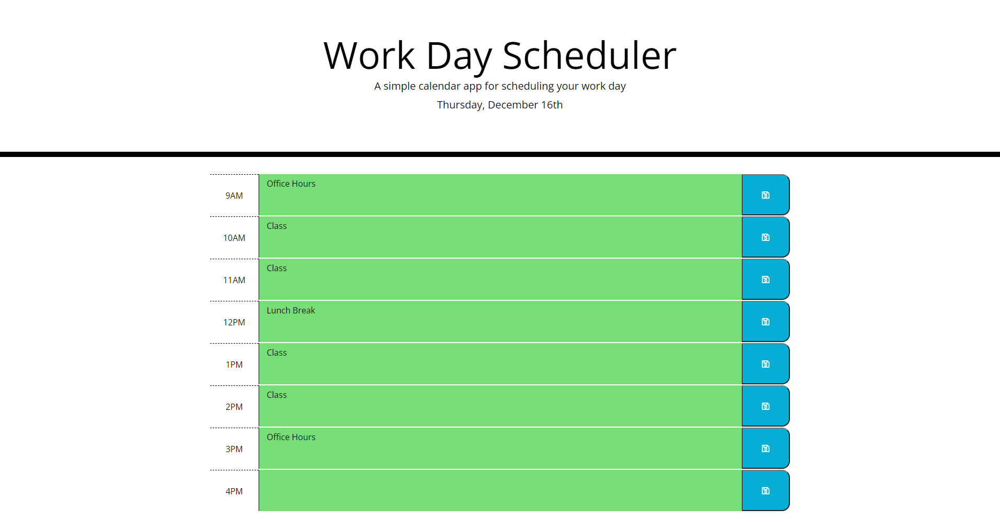

# Day-Planner
## Description
This day planner will allow you to list events that take place each hour from 9AM to 5PM, and save that data to localstorage.
## Installation
You can view the repository at https://github.com/MHranek/Day-Planner or access the deployed site at https://mhranek.github.io/Day-Planner/
## Usage
To use this app simply type out a message in the corresponding text field and click the save button on the right, this will allow you to refresh the page and keep the inputed data displaying.
